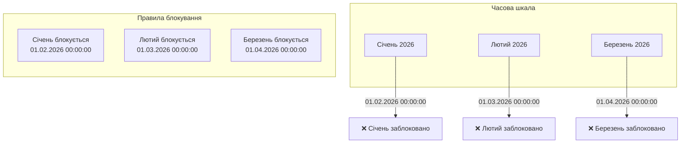
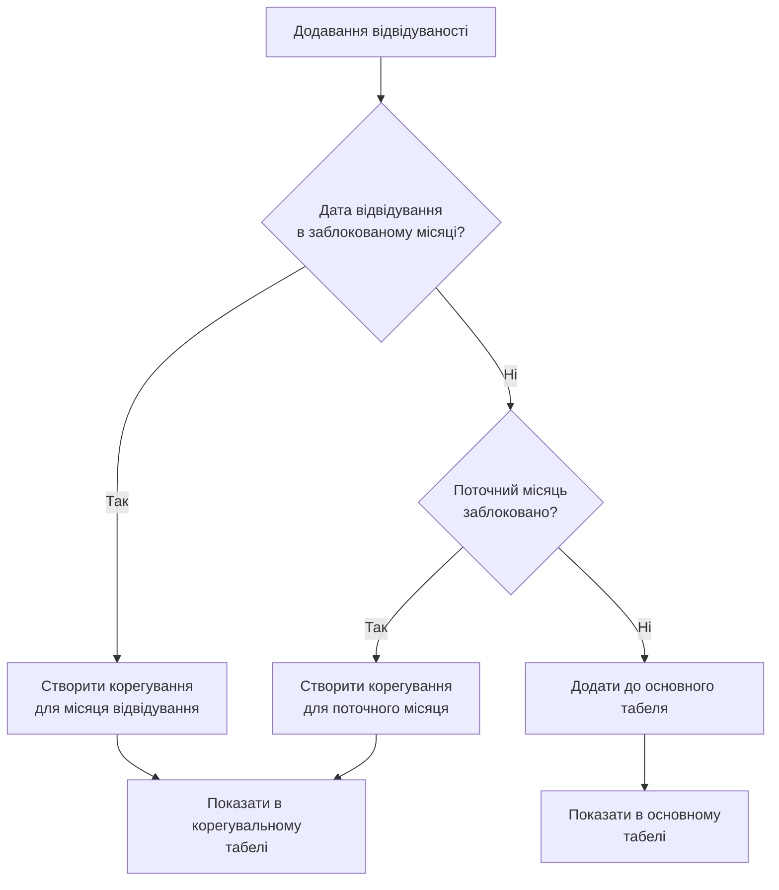
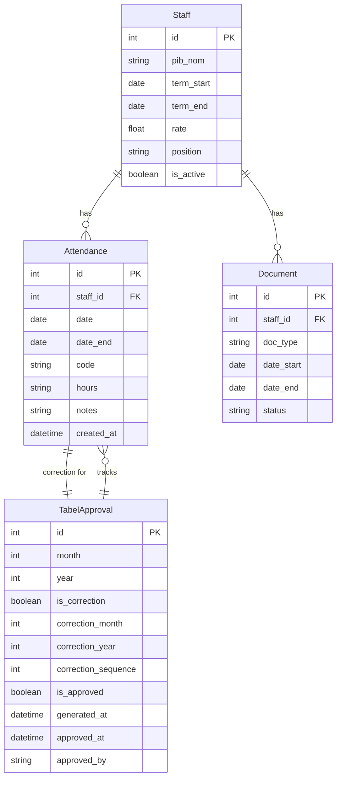
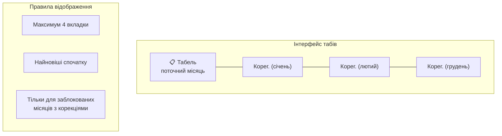

# VacationManager v7.7.4

Система управління відпустками та табелем обліку робочого часу для університетської кафедри.

## Версія Latest (v7.7.4) - Bug Fixes & Tabel Improvements

### Проект

**VacationManager** — гібридна екосистема (Desktop + Web) для автоматизації кадрового діловодства кафедри університету.

### Основні функції

- Управління персоналом кафедри (з підтримкою кількох позицій на одного співробітника)
- Річний графік відпусток з візуальним плануванням
- Конструктор заяв з WYSIWYG-редактором та live preview
- Генерація PDF документів з українською морфологією (WeasyPrint + Jinja2)
- **Табель обліку робочого часу** — автоматична генерація табеля з усіма кодами відвідуваності
- **Web UI (React)** — сучасний веб-інтерфейс для співробітників та завідувача кафедри
- **Web portal** для завантаження сканів підписаних документів
- WebSocket синхронізація між Desktop та Web
- **Повний workflow підписання документів**: заявник → диспетчерська → завідувач → наказ → ректор
- **ПІБ у давальному відмінку** — автоматична генерація для документів з можливістю ручного редагування
- **Контроль дат контракту** — відмітки про відвідування додаються лише на період дії контракту/заяви/конкурсу

### Технологічний стек

**Backend:**
- Python 3.10+, FastAPI, SQLAlchemy 2.0, Alembic
- JWT Auth (bcrypt), WebSocket support
- SQLite database

**Frontend (WebUI):**
- React 18, TypeScript, Vite
- Zustand (state management)
- Axios (HTTP client)

**Desktop:**
- PyQt6, PyQt6-WebEngine

**Document Generation:**
- WeasyPrint (HTML to PDF), Jinja2 templates

**Grammar & Logging:**
- pymorphy3 (Ukrainian morphology), structlog

---

## Останні оновлення (січень 2026)

### v7.7.3 - Stale Document Tracking & Bulk Operations

**Stale Document Monitoring:**
- **Database Fields:** Додано поля `status_changed_at`, `stale_notification_count`, `stale_explanation` до таблиці documents
- **StaleDocumentService:** Сервіс для моніторингу документів, статус яких не змінювався більше 1 дня
- **Automatic Detection:** Автоматичне виявлення застарілих документів з керованими статусами (DRAFT, ON_SIGNATURE, AGREED, SIGNED, SCANNED)
- **Notification System:** Лічильник сповіщень з лімітом (3), після якого вимагається дія користувача
- **Resolution Actions:** Можливість пояснити затримку або видалити застарілий документ

**Bulk Document Operations:**
- **Validation Endpoint:** `/api/bulk/validate` — перевірка можливості масового створення документів для списку співробітників
- **Generate Endpoint:** `/api/bulk/generate` — масове створення документів для валідних співробітників
- **Staff Validation:** Перевірка конфліктів дат, активності співробітників, наявності необхідних даних
- **Department Head Access:** Можливості доступні лише завідувачам кафедри

**Integration Tests:**
- Тести для stale document tracking (test_stale_documents.py)
- Тести для bulk operations (test_document_scenarios.py, test_new_endpoints.py)
- Тести для desktop simulation (test_desktop_simulation.py)

### v7.7.4 - Bug Fixes & Tabel Improvements

**Bug Fixes:**
- **Approval Button Visibility:** Виправлено баг, коли кнопка погодження табеля залишалася активною після погодження, що дозволяло повторні натискання
  - Кнопка тепер коректно приховується для звичайних та корегуючих табелів
  - Виправлено логіку `is_generated and not is_approved` для коректного відображення
- **Hours Calculation Positions:** Виправлено збереження позицій для розрахунку годин
  - Раніше зберігалися українські мітки ("Фахівець"), зараз — значення enum ("specialist")
  - Це забезпечує правильну роботу розрахунку годин у табелі

**Tabel Improvements:**
- **Correction Tabs Visual Indicators:** Додано візуальні індикатори для погоджених корегуючих табелів (червона рамка)
- **Close Button on Approved Corrections:** Кнопка закриття прихована на погоджених корегуючих табелях для запобігання випадкового видалення
- **Auto-Refresh on Tab Show:** Корегуючі табелі автоматично оновлюються при відкритті вкладки
- **Raw Data Archiving:** Архіви табелів тепер містять повні сирі дані (attendance, staff, vacations) для точного відновлення

**Employment Documents:**
- **New Templates:** Додано шаблони для документів про прийом на роботу (employment_competition, employment_contract, employment_pdf)

**Web UI:**
- **Resolve Stale Modal:** Додано модальне вікно для вирішення проблем застарілих документів
- **Ukrainian Locale:** Додано українську локізацію для antd компонентів
- **Stale Status Indicators:** Відображення статусу застарілих документів у списку та деталях

### v7.7.3 - Stale Document Tracking & Bulk Operations

**Employment Document System:**
- **New Document Types:** Додано три типи документів про прийом на роботу (employment_contract, employment_competition, employment_pdf)
- **Employment Templates:** HTML шаблони для генерації документів про прийом (contract, competition, PDF)
- **New Employee Data Staging:** Поле `new_employee_data` в Document для збереження даних нового співробітника перед створенням
- **Automatic Staff Creation:** При завантаженні скану підписаного документа про прийом автоматично створюється запис співробітника
- **Term Extension Processing:** Документи продовження контракту автоматично оновлюють дату закінчення та активують співробітника

**Backend Improvements:**
- **PIB Format Validation:** Валідація формату ПІБ (Прізвище Ім'я По батькові) з перевіркою українських/латинських літер
- **Head of Department Uniqueness:** Перевірка унікальності посади завідувача кафедри
- **Term Date Validation:** Валідація що дата закінчення контракту пізніша за дату початку
- **Position Label Translation:** Функція `get_position_label()` для перекладу enum значень посад

**Desktop UI Enhancements:**
- **New Employee Mode:** Спеціальний режим конструктора для створення документів про прийом
- **Smart Filtering:** Автоматичне приховування/показ типів документів про прийом залежно від режиму
- **Employment Type Selector:** Вибор основи працевлаштування (контракт/конкурс/заява)
- **Reactivation Handling:** Підтримка реактивації раніше звільнених співробітників
- **Styles Module:** Новий модуль `desktop/ui/styles.py` для уніфікації стилів інтерфейсу
- **Splash Screen:** Оновлено дизайн під Light Theme

**Web UI Improvements:**
- **Attendance View:** Додано відображення загальної кількості днів для записів з діапазоном дат
- **Column Widths:** Оптимізовано ширину колонок для кращої видимості

**Bug Fixes:**
- Виправлено дублювання коментаря сканування
- Виправлено накладання тексту та вирівнювання в UI

### v7.4.5 - Новий WebUI та розширене API

**Повноцінний React/TypeScript WebUI:**
- React 18 з TypeScript та Vite build system
- Axios-based API client з typed endpoints
- Zustand state management для auth та UI
- **Сторінки:** Dashboard, Staff (список/деталі), Documents (створення/список/деталі/скани), Schedule, Attendance, Settings, Auth (Login)
- **Компоненти Layout:** Header, Sidebar, MainLayout
- API інтеграція з endpoint-ами бекенду

**Нові API Routes:**
- `backend/api/routes/auth.py` — JWT автентифікація (login, logout, refresh, register)
- `backend/api/routes/attendance.py` — керування відвідуваністю
- `backend/api/routes/dashboard.py` — агрегована статистика
- `backend/api/routes/settings.py` — налаштування додатку
- `backend/api/routes/tabel.py` — генерація та управління табелями

**Нові Pydantic Schemas:**
- `backend/schemas/auth.py` — AuthRequest, TokenResponse, UserResponse
- `backend/schemas/attendance.py` — AttendanceCreate, AttendanceResponse
- `backend/schemas/dashboard.py` — DashboardStats, StaffStats, DocumentStats

**Backend Core:**
- `backend/core/security.py` — JWT токени, хешування паролів (bcrypt)
- `backend/core/dependencies.py` — dependency injection для FastAPI
- `backend/debug_settings.py` — debug конфігурація

**Document Renderer Service:**
- `backend/services/document_renderer.py` — сервіс рендерингу документів з шаблонів
- `backend/templates/documents/` — HTML шаблони для всіх типів відпусток
- `backend/templates/tabel/` — шаблони табеля
- `backend/templates/tabel_corection/` — шаблони корегувальних табелів

**Database Migration:**
- `alembic/versions/20260117_*` — видалено unique constraint з annual_schedule

**Additional Files:**
- `run.py` — main entry point для запуску додатку
- `desktop/__main__.py` — desktop application module
- `tabel/` — архіви табелів з даними про підписи

### v7.2.0 - Покращена архівація документів

### Major Changes

#### 1. Завантаження сканів документів
Можливість завантажувати сканери вже підписаних документів, створених співробітником самостійно:

- **ScanUploadDialog** — діалог для вибору типу документа, дат та скану
- Кнопка "📎 Завантажити скан" в картці працівника
- Створюється запис Document зі статусом SIGNED
- Скан копіюється в `desktop/documents/{doc_id}/scans/`
- Автоматично додаються відмітки до табеля для відпуск
- **Статус "Не підтверджено"** — для підписаних документів без скану (червоний фон)

#### 2. Документи продовження контракту

**Нові типи документів:**
- `term_extension` — базове продовження
- `term_extension_contract` — продовження за контрактом
- `term_extension_competition` — продовження за конкурсом
- `term_extension_pdf` — продовження сумісництва (PDF)

**Поля для продовження:**
- `extension_start_date` — дата початку продовження
- `old_contract_end_date` — дата закінчення попереднього контракту

**Логіка продовження:**
- Документи продовження створюють відмітку з кодом "Р" (робочі дні)
- Працівник продовжує працювати після підписання ректором

**Шаблони:**
- `term_extension_contract.html` — з полями ставки, кафедри, дат
- `term_extension_competition.html` — для конкурсного переведення
- `term_extension_pdf.html` — для сумісників

#### 3. Контроль дат контракту
Валідація періоду дії працівника при додаванні відміток:

- **AttendanceConflictError** — новий тип виключення для конфліктів дат
- **check_conflicts()** — перевірка накладання періодів відвідування
- Валідація в _on_add_absence() та _on_edit_absence()
- Динамічні повідомлення залежно від основи роботи (контракт/конкурс/заява)
- Відмітки поза межами контракту відображаються закресленими в табелі

#### 2. ПІБ у давальному відмінку
Генерація та збереження давального відмінка для документів:

- **pib_dav** — нове поле в моделі Staff
- **GrammarService.to_dative()** — автоматична генерація давального відмінка
- UI в картці працівника з кнопками "Згенерувати" та "Зберегти"
- Підтвердження результату з можливістю ручного редагування

#### 3. Табель обліку робочого часу (TabelService)
Повноцінна система генерації табеля згідно з наказом Мінпраці №55:

**`tabel_service.py`** (30KB) — сервіс генерації табеля:
- Автоматичний розрахунок робочих днів та годин за місяць
- Підтримка всіх літерних кодів відвідуваності (Р, В, ВД, ТН, тощо)
- Розрахунок підсумків по півмісяцях та за місяць
- Підтримка надурочних годин (НУ), нічних (РН), вечірніх (ВЧ), вихідних (РВ)
- Генерація HTML з Jinja2 шаблоном
- Пагінація (кількість працівників на сторінці)
- **Контрактні межі** — дні до початку та після закінчення контракту:
  - Відображаються порожніми з суцільною лінією
  - З'єднання ліній між комірками та між рядками
  - Вихідні дні НЕ отримують лінію (порожні як зазвичай)
- **Деактивовані працівники** — виключаються з табеля наступного місяця
- Підсумки відсутностей за категоріями:
  - Відпустки 8-10 днів (вак_8_10)
  - Відпустки 11-15 днів (вак_11_15)
  - Відпустки 18 днів (вак_18)
  - Відпустки 19 днів (вак_19)
  - Відрядження, неповний день, тощо

**`attendance.py`** — модель відвідуваності:
- Повний список кодів згідно з наказом Мінпраці №55 (30+ кодів)
- Літерний код → числовий код (наприклад, Р → 01)
- Підтримка діапазонів дат (`date_end`)
- Properties для перевірки типу: `is_work_day`, `is_vacation`, `is_sick_leave`, тощо

#### 2. Attendance Tracking (AttendanceService)
**`attendance_service.py`** (8KB) — CRUD для записів відвідуваності:
- `create_attendance()` — створення запису на один день
- `create_attendance_range()` — створення діапазону дат
- `get_staff_attendance()` — отримання за місяць/рік
- `update_attendance()`, `delete_attendance()`, `delete_attendance_range()`
- Автоматичне оновлення існуючих записів при дублюванні

#### 3. Staff History Tracking
**`staff_history.py`** — модель історії змін співробітників:
- Відстеження всіх змін (CREATE, UPDATE, DEACTIVATE, RESTORE)
- JSON зі старими значеннями (тільки змінені поля)
- `changed_by` — хто вніс зміни
- `comment` — коментар до зміни

#### 4. Shared Absence Types
**`absence_types.py`** — централізовані типи відсутностей для UI:
- Групи типів з українськими назвами
- Маппінг назв → код (CODE_TO_ABSENCE_NAME)
- Коди що вимагають вказання годин (CODES_REQUIRING_HOURS)

#### 5. WeasyPrint замість docxtpl
- HTML → PDF замість Word → PDF
- Jinja2 шаблони в `desktop/templates/tabel/`
- Краща підтримка української мови та шрифтів

#### 6. Вдосконалений Workflow
Повний ланцюжок підписання:
1. **Draft** — чернетка заявки
2. **On Signature** — на підписі (до 3 відпусток, 1 контракт)
3. **Signed** — підписано всіма
4. **Processed** — оброблено (дні списано, додано до табеля)

#### 7. Структурне логування (structlog)
- JSON або консольний формат
- Рівні: DEBUG, INFO, WARNING, ERROR, CRITICAL
- Контекстне логування для кращої дебаг-інформації

#### 8. Українська морфологія
**`grammar_service.py`** — розширений сервіс морфології:
- **to_dative()** — давальний відмінок ПІБ (для документів)
- to_genitive() — родовий відмінок
- to_accusative() — знахідний відмінок (підготовлено)
- decline_position() — відмінювання посад

#### 9. Нові виключення
**`shared/exceptions.py`**:
- **AttendanceConflictError** — конфлікт дат у відвідуванні
- GrammarError — помилки морфології

### Оновлені Константи

** Ukrainian Attendance Codes (наказ Мінпраці №55)**
```
# Явки на роботу
Р = "01"  # Години роботи за договором
РС = "20" # Неповний робочий день
ВЧ = "03" # Вечірні години
РН = "04" # Нічні години
НУ = "05" # Надурочні години
РВ = "06" # Робота у вихідні/святкові

# Відрядження
ВД = "10" # Службове відрядження

# Відпустки оплачувані
В = "08"  # Основна щорічна
Д = "09"  # Додаткова щорічна
Ч = "11"  # Чорнобильцям
ТВ = "12" # Творча відпустка
Н = "13"  # У зв'язку з навчанням
ДО = "16" # З дітьми
ВП = "17" # Вагітність/догляд до 3 років
ДД = "18" # Догляд за дитиною до 6 років

# Відпустки без зарплати
НБ = "14" # У зв'язку з навчанням
ДБ = "15" # Обов'язкова без збереження
НА = "21" # За згодою сторін
БЗ = "22" # Інші без зарплати

# Неявки
НД = "20" # Неповний робочий день
НП = "21" # Тимчасовий переклад
ІН = "22" # Інший невідпрацьований час
П = "23"  # Простої
ПР = "24" # Прогули
С = "25"  # Страйки

# Тимчасова непрацездатність
ТН = "26" # Оплачувана
НН = "27" # Неоплачувана

# Інші причини
НЗ = "28" # Нез'ясовані причини
ІВ = "29" # Інші види за колдоговором
І = "30"  # Інші причини
```

### Нові Моделі / Оновлені Моделі

```
backend/models/
├── attendance.py     # відмітки про явки/неявки
├── staff.py          # +pib_dav (давальний відмінок)
├── staff_history.py  # історія змін співробітників
├── document.py       # +extension_start_date, +old_contract_end_date, +new_employee_data
```

### Оновлені Schemas

```
backend/schemas/
├── attendance.py     # схеми для відвідуваності
├── tabel.py          # схеми для табеля
├── document.py       # +EmploymentCreate, +new_employee_data field
└── staff.py          # +PIB validation, term date validation
```

---

## Встановлення

### Клонування репозиторію

```bash
git clone <repository-url>
cd VacationManager
```

### Створення віртуального середовища

```bash
python -m venv venv

# Windows
venv\Scripts\activate

# Linux/Mac
source venv/bin/activate
```

### Встановлення залежностей

```bash
pip install -r requirements.txt
```

### Налаштування

```bash
copy .env.example .env
```

Відредагуйте `.env` при необхідності.

## Використання

### Ініціалізація бази даних

```bash
# Створення міграції
alembic revision --autogenerate -m "description"

# Застосування міграцій
alembic upgrade head
```

### Запуск Web сервера

```bash
# Using run.py (recommended)
python run.py

# Or directly
python -m backend.main
```

API буде доступно за адресою: http://127.0.0.1:8000

- API Documentation: http://127.0.0.1:8000/docs
- Upload Portal: http://127.0.0.1:8000/upload-portal

### Запуск WebUI (React)

```bash
cd web
npm install
npm run dev
```

WebUI буде доступно за адресою: http://localhost:5173

**Production build:**
```bash
cd web
npm run build
# Сервування статичних файлів через FastAPI або nginx
```

### Запуск Desktop додатку

```bash
python -m desktop.main
```

### Генерація табеля

```python
from backend.services.tabel_service import generate_tabel_html

# Генерація HTML для січня 2026
html = generate_tabel_html(month=1, year=2026)

# Збереження у файл
from backend.services.tabel_service import save_tabel_to_file
filepath = save_tabel_to_file(html, month=1, year=2026)
```

## Тестування

```bash
# Запуск всіх тестів
pytest

# Запуск unit тестів
pytest tests/unit

# Запуск integration тестів
pytest tests/integration

# Запуск з покриттям
pytest --cov=backend --cov=desktop
```

## Структура проекту

```
VacationManager/
├── backend/                # FastAPI backend
│   ├── core/              # Config, Database, Security, Logging
│   │   ├── config.py
│   │   ├── database.py
│   │   ├── security.py        # НОВЕ - JWT, password hashing
│   │   └── dependencies.py    # НОВЕ - FastAPI dependencies
│   ├── models/            # SQLAlchemy ORM models
│   │   ├── base.py
│   │   ├── staff.py          # +pib_dav
│   │   ├── document.py
│   │   ├── schedule.py
│   │   ├── settings.py
│   │   ├── attendance.py
│   │   └── staff_history.py
│   ├── schemas/           # Pydantic schemas
│   │   ├── schedule.py
│   │   ├── responses.py
│   │   ├── staff.py          # +PIB validation, term date validation
│   │   ├── document.py       # +EmploymentCreate, new_employee_data field, +BulkValidationRequest, +BulkGenerateRequest
│   ├── schemas/           # Pydantic schemas
│   │   ├── schedule.py
│   │   ├── responses.py
│   │   ├── staff.py          # +PIB validation, term date validation
│   │   ├── document.py       # +EmploymentCreate, new_employee_data field
│   │   ├── attendance.py
│   │   ├── tabel.py
│   │   ├── auth.py
│   │   └── dashboard.py
│   ├── services/          # Business logic
│   │   ├── grammar_service.py
│   │   ├── validation_service.py
│   │   ├── document_service.py
│   │   ├── bulk_document_service.py
│   │   ├── stale_document_service.py  # НОВЕ - stale document monitoring
│   │   ├── schedule_service.py
│   │   ├── staff_service.py          # +create_staff_from_document, +process_term_extension
│   │   ├── date_parser.py
│   │   ├── attendance_service.py
│   │   ├── tabel_service.py
│   │   └── document_renderer.py      # HTML to PDF rendering
│   ├── api/
│   │   ├── routes/        # FastAPI endpoints
│   │   │   ├── documents.py
│   │   │   ├── staff.py
│   │   │   ├── schedule.py
│   │   │   ├── upload.py
│   │   │   ├── attendance.py
│   │   │   ├── tabel.py
│   │   │   ├── auth.py         # НОВЕ - JWT auth endpoints
│   │   │   ├── dashboard.py    # НОВЕ
│   │   │   ├── bulk.py         # НОВЕ - bulk operations
│   │   │   └── settings.py     # НОВЕ
│   │   └── dependencies.py
│   ├── templates/         # HTML templates для документів
│   │   ├── documents/         # НОВЕ - 20+ шаблонів відпусток
│   │   ├── tabel/             # НОВЕ - шаблони табеля
│   │   └── tabel_corection/   # НОВЕ - корегувальні табелі
│   ├── static/            # CSS, JS для upload portal
│   └── debug_settings.py  # НОВЕ
├── web/                   # НОВЕ - React/TypeScript WebUI
│   ├── src/
│   │   ├── api/           # Axios client, endpoints, types
│   │   ├── components/    # Layout components (Header, Sidebar, MainLayout)
│   │   ├── pages/         # Page components
│   │   │   ├── auth/      # Login
│   │   │   ├── dashboard/ # Dashboard
│   │   │   ├── staff/     # Staff list/detail
│   │   │   ├── documents/ # Documents (create/list/detail/scan)
│   │   │   ├── schedule/  # Schedule view
│   │   │   ├── attendance/# Attendance view
│   │   │   └── settings/  # Settings
│   │   ├── stores/        # Zustand stores (auth, ui)
│   │   ├── App.tsx
│   │   └── main.tsx
│   ├── package.json
│   ├── vite.config.ts
│   └── tsconfig.json
├── desktop/               # PyQt6 Desktop application
│   ├── ui/                # UI components
│   │   ├── scan_upload_dialog.py
│   │   ├── styles.py      # НОВЕ - UI styles module
│   │   └── ...
│   ├── widgets/           # Custom widgets
│   │   ├── status_badge.py
│   │   ├── live_preview.py
│   │   └── splash_screen.py
│   ├── templates/         # Jinja2 templates для PDF
│   │   ├── tabel/         # шаблони табеля
│   │   └── documents/     # шаблони документів
│   │       ├── employment_contract.html      # НОВЕ
│   │       ├── employment_competition.html   # НОВЕ
│   │       └── employment_pdf.html           # НОВЕ
│   └── __main__.py
├── tabel/                 # НОВЕ - Архіви табелів
│   └── archive/           # JSON archives with signature data
├── shared/                # Shared code
│   ├── enums.py
│   ├── constants.py
│   ├── validators.py
│   ├── exceptions.py
│   └── absence_types.py
├── storage/               # Generated documents and scans
│   └── tabels/            # згенеровані табелі
├── tests/
│   ├── unit/
│   └── integration/
│       ├── test_desktop_simulation.py    # НОВЕ
│       ├── test_document_scenarios.py    # НОВЕ
│       ├── test_new_endpoints.py         # НОВЕ
│       └── test_stale_documents.py       # НОВЕ
├── alembic/               # Database migrations
│   └── versions/
│       ├── 20260120_*     # НОВЕ - add stale tracking fields
│       └── 20260117_*     # remove unique constraint
├── run.py                 # НОВЕ - Main entry point
├── package.json           # НОВЕ - Root package.json
└── requirements.txt
```

## API Reference

Базовий URL: `http://127.0.0.1:8000/api`

> **Автентифікація**: Більшість ендпоінтів вимагають JWT токен у заголовку `Authorization: Bearer <token>`. Отримайте токен через `/auth/login`.

### Ролі користувачів

| Роль | Опис | Права доступу |
|------|------|---------------|
| **admin** | Адміністратор | Повний доступ до всіх функцій |
| **department_head** | Завідувач кафедри | Перегляд всіх даних, створення/редагування, затвердження документів |
| **employee** | Співробітник | Перегляд власних даних, створення заяв |

**Легенда в таблицях API:**
- `✓` - Всі автентифіковані користувачі
- `Head` - department_head та вище
- `Admin` - тільки admin

### Auth (`/auth`)

| Method | Endpoint | Auth | Description |
|--------|----------|------|-------------|
| POST | `/login` | - | Автентифікація користувача |
| POST | `/logout` | ✓ | Вихід з системи |
| POST | `/refresh` | - | Оновлення access token |
| GET | `/me` | ✓ | Інформація про поточного користувача |
| POST | `/register` | - | Реєстрація нового користувача |
| POST | `/change-password` | ✓ | Зміна пароля |

### Staff (`/staff`)

| Method | Endpoint | Auth | Description |
|--------|----------|------|-------------|
| GET | `/` | ✓ | Список співробітників (пагінація, пошук) |
| GET | `/{id}` | Head | Деталі співробітника |
| POST | `/` | Admin | Створити співробітника |
| PUT | `/{id}` | Head | Оновити співробітника |
| DELETE | `/{id}` | Admin | Видалити (soft delete) |
| GET | `/search` | Head | Пошук за ім'ям/позицією |
| GET | `/{id}/documents` | ✓ | Документи співробітника |
| GET | `/{id}/schedule` | ✓ | Графік відпусток |
| GET | `/{id}/attendance` | ✓ | Відвідуваність |
| GET | `/expiring-contracts` | Head | Контракти, що закінчуються |

### Documents (`/documents`)

| Method | Endpoint | Auth | Description |
|--------|----------|------|-------------|
| GET | `/` | ✓ | Список документів (фільтри, пагінація) |
| GET | `/{id}` | ✓ | Деталі документа |
| GET | `/{id}/context` | ✓ | Контекст для відображення |
| POST | `/` | ✓ | Створити документ |
| POST | `/{id}/upload-scan` | ✓ | Завантажити скан |
| POST | `/direct-scan-upload` | ✓ | Пряме завантаження скану |
| POST | `/preview` | ✓ | Попередній перегляд |
| GET | `/types` | - | Типи документів |
| GET | `/staff/{id}/blocked-days` | ✓ | Заблоковані дні співробітника |

### Schedule (`/schedule`)

| Method | Endpoint | Auth | Description |
|--------|----------|------|-------------|
| GET | `/annual` | Head | Річний графік відпусток |
| GET | `/{year}` | Head | Графік на рік |
| POST | `/` | Head | Створити запис графіку |
| PUT | `/{id}` | Head | Оновити запис |
| DELETE | `/{id}` | Head | Видалити запис |
| POST | `/auto-distribute` | Head | Авторозподіл відпусток |
| GET | `/stats` | Head | Статистика графіку |

### Attendance (`/attendance`)

| Method | Endpoint | Auth | Description |
|--------|----------|------|-------------|
| GET | `/daily` | Head | Відвідуваність за день |
| POST | `/` | Head | Створити запис |
| POST | `/correction` | Head | Запит на корекцію |
| POST | `/submit` | Head | Подати табель |
| POST | `/tabel/approve` | Head | Затвердити табель |
| GET | `/tabel` | Head | Отримати табель за місяць |

### Tabel (`/tabel`)

| Method | Endpoint | Auth | Description |
|--------|----------|------|-------------|
| GET | `/generate` | Head | Згенерувати HTML табеля |
| GET | `/preview` | Head | Попередній перегляд |
| POST | `/archive` | Head | Зберегти архів |
| GET | `/archives` | Head | Список архівів |
| GET | `/archives/{filename}` | Head | Деталі архіву |
| GET | `/locked-months` | Head | Заблоковані місяці |
| GET | `/corrections` | Head | Місяці з корекціями |
| POST | `/approve` | Head | Погодити табель |
| GET | `/status` | Head | Статус табеля |

### Dashboard (`/dashboard`)

| Method | Endpoint | Auth | Description |
|--------|----------|------|-------------|
| GET | `/stats` | ✓ | Статистика (працівники, документи) |

### Settings (`/settings`)

| Method | Endpoint | Auth | Description |
|--------|----------|------|-------------|
| GET | `/` | ✓ | Поточні налаштування |
| PUT | `/` | ✓ | Оновити налаштування |

### Bulk (`/bulk`)

| Method | Endpoint | Auth | Description |
|--------|----------|------|-------------|
| POST | `/validate` | Head | Перевірити можливість масового створення документів |
| POST | `/generate` | Head | Масово створити документи для списку співробітників |

### Upload (`/upload`)

| Method | Endpoint | Auth | Description |
|--------|----------|------|-------------|
| POST | `/{document_id}` | - | Завантажити скан документа |

### WebSocket (`/ws`)

Real-time синхронізація між Desktop та Web додатками.

```javascript
const ws = new WebSocket('ws://localhost:8000/ws');
ws.onmessage = (event) => {
  const message = JSON.parse(event.data);
  // message.type: 'document_signed', 'status_changed', 'pong'
};
// Ping/pong для keepalive
ws.send(JSON.stringify({ type: 'ping' }));
```

## Документообіг

### Типи документів

**Відпустки:**
- `vacation_paid` — основна щорічна відпустка
- `vacation_unpaid` — відпустка без збереження зарплати
- `vacation_main` — відпустка за основним місцем роботи
- `vacation_additional` — додаткова відпустка
- `vacation_study` — навчальна відпустка
- `vacation_children` — відпустка для догляду за дитиною
- `vacation_unpaid_study` — навчальна відпустка без збереження

**Продовження контракту:**
- `term_extension` — базове продовження
- `term_extension_contract` — продовження за контрактом
- `term_extension_competition` — продовження за конкурсом
- `term_extension_pdf` — продовження сумісництва (PDF)

**Прийом на роботу (НОВЕ):**
- `employment_contract` — прийом на роботу (контракт)
- `employment_competition` — прийом на роботу (конкурс)
- `employment_pdf` — прийом на роботу (PDF)

### Статуси документів

```
Draft → On Signature → Signed → Processed
```

**Статус "Не підтверджено":**
- Документ має статус "Підписано" або "Оброблено"
- Але скан документа відсутній
- Відображається червоним кольором в таблиці

### Workflow підписання

1. **Заявник** - створює та підписує заяву
2. **Диспетчерська** - перевіряє та погоджує
3. **Завідувач кафедри** - підписує
4. **Наказ** - реєструє наказ
5. **Ректор** - фінальне підписання
6. **Сканування** - завантаження скану
7. **Табель** - автоматичне додавання до табеля обліку

### Літерні коди табеля

Повний список кодів згідно з наказом Мінпраці №55:
- **Р** — робочі дні
- **В** — щорічна відпустка
- **ВД** — відрядження
- **ТН** — тимчасова непрацездатність (лікарняний)
- **НУ** — надурочні години
- **РН** — нічні години
- **ВЧ** — вечірні години
- **РВ** — робота у вихідні
- [та багато інших...]

## Система корегування таблів

### Автоматичне блокування місяців

Місяць M автоматично блокується о 00:00:00 першого числа місяця M+1.



### Логіка додавання записів



**Пріоритети:**
1. Якщо дата відвідування в заблокованому місяці → корегування для того місяця
2. Якщо поточний місяць заблоковано → корегування для поточного місяця
3. Інакше → додати до основного табеля

**Приклад:**
- Тіврцнн І. Л.: контракт з 16.12.2025, відмітка 15.01.2026
  - Січень НЕ заблоковано (до 01.02.2026)
  - Відмітка ДОДАЄТЬСЯ до основного табеля за січень
  - Працівник з'являється в січневому табелі (не в грудневому корегуванні)

### Схема даних



### Структура корегувального табеля

**Хто потрапляє до корегувального табеля:**

1. Працівники з відмітками за цей місяць (після того, як місяць заблоковано)
2. Працівники, додані ПІСЛЯ блокування місяця, контракт яких ПОЧИНАЄТЬСЯ в цьому місяці

**Логіка днів у корегуванні:**

```mermaid
flowchart TB
    subgraph CorrectionTabel [Корегувальний табель]
        direction TB
        Row1["Працівник доданий після<br/>блокування місяця"]
    end

    subgraph DayLogic [Логіка днів у корегуванні]
        direction LR
        D1["1-15 грудня<br/>• До дати контракту: ═══ (закреслено)<br/>• Від дати контракту: Р (робочі дні)<br/>• Вихідні: порожньо"]
        D2["Корекція<br/>• Дні з відміткою: код<br/>• Дні без відмітки: Р"
    end

    Row1 --> D1
    Row1 --> D2
```

**Приклад для нового працівника (контракт з 16 грудня, доданий 15 січня):**

| Дні 1-15 | Дні 16-31 |
|----------|-----------|
| ═══ (закреслено) | Р |
| ═══ (закреслено) | Р |
| ═══ (закреслено) | ВД (відрядження) |
| ═══ (закреслено) | ТН (лікарняний) |
| ═══ (закреслено) | Р |

- Дні до контракту (1-15): закреслені (працівника ще не було)
- Дні від контракту (16-31): "Р" (робочі дні)
- Відмітка на 18 грудня: показує код "ВД" замість "Р"

**Важливо:** Якщо працівник був доданий ДО блокування грудня (до 01.02.2026), він буде в основному табелі за грудень, а не в корегуванні.


### UI: Динамічні вкладки корегувань



## Код-стайл

- **PEP 8** форматування (black)
- **Google Style** docstrings
- Коментарі українською мовою
- Type hints обов'язкові
- DRY, SOLID, Clean Architecture

## Ліцензія

© 2025-2026 VacationManager v7.7.3

---

## Версіювання

| Версія | Дата | Зміни |
|--------|------|-------|
| v7.7.3 | Січень 2026 | **Stale Document Tracking** (моніторинг застарілих документів), **Bulk Operations** (масове створення документів), integration tests |
| v7.7.1 | Січень 2026 | **Employment Document Flow**, автоматичне створення співробітників з документів про прийом, валідація ПІБ, унікальність завідувача кафедри, покращення UI |
| v7.4.5 | Січень 2026 | **Повноцінний WebUI (React/TS + Vite)**, нові API routes (auth, attendance, dashboard, settings, tabel), document renderer service, розширені шаблони |
| v7.2.0 | Січень 2026 | Покращена архівація документів, StaffPosition enum, PIB у давальному відмінку |
| v7.0 | Січень 2026 | Web UI (React prototype), JWT Auth, REST API, Покращений Workflow |
| v6.0 | Січень 2026 | Табель обліку, Attendance Tracking, Workflow |
| v5.0 | 2025 | Базова функціональність |


